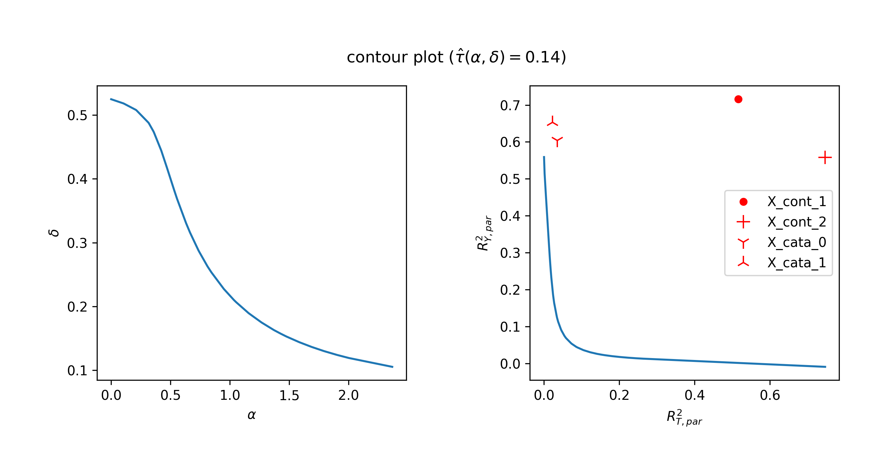
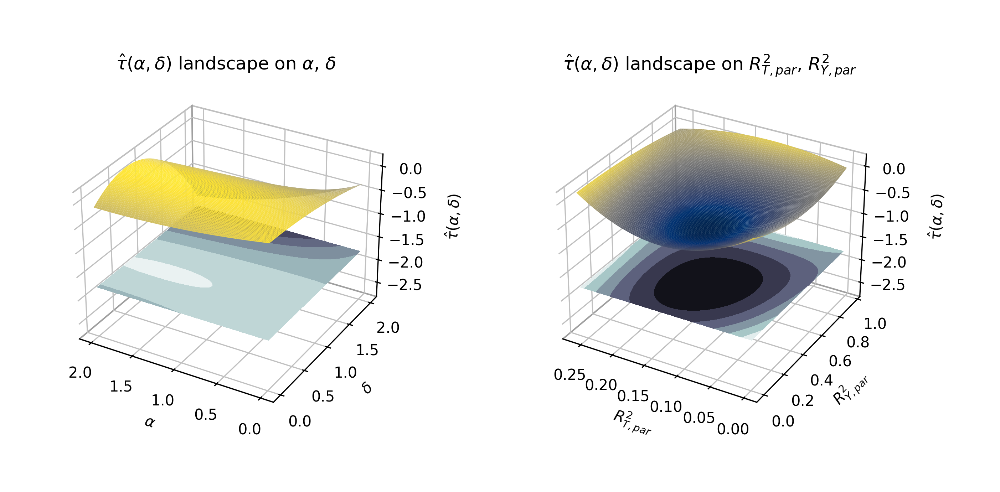
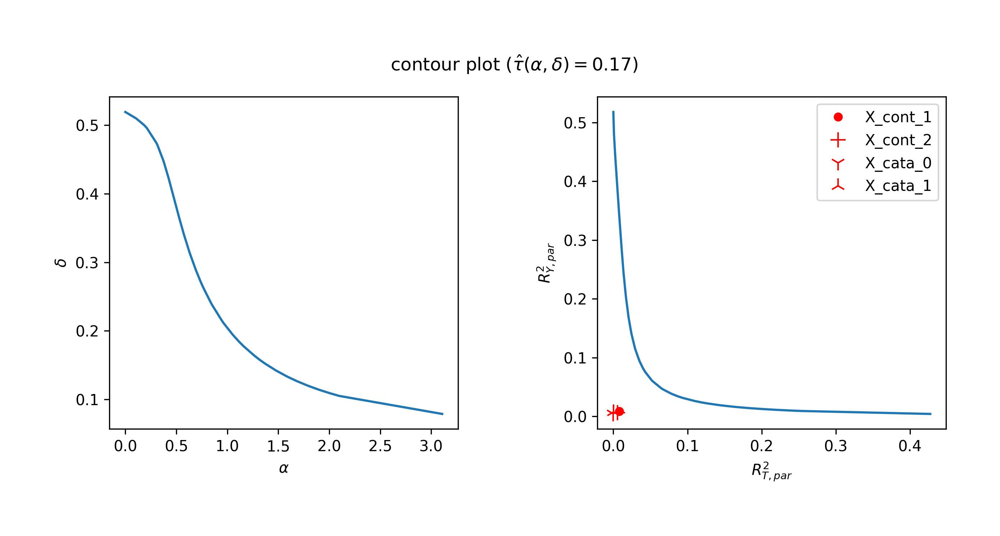
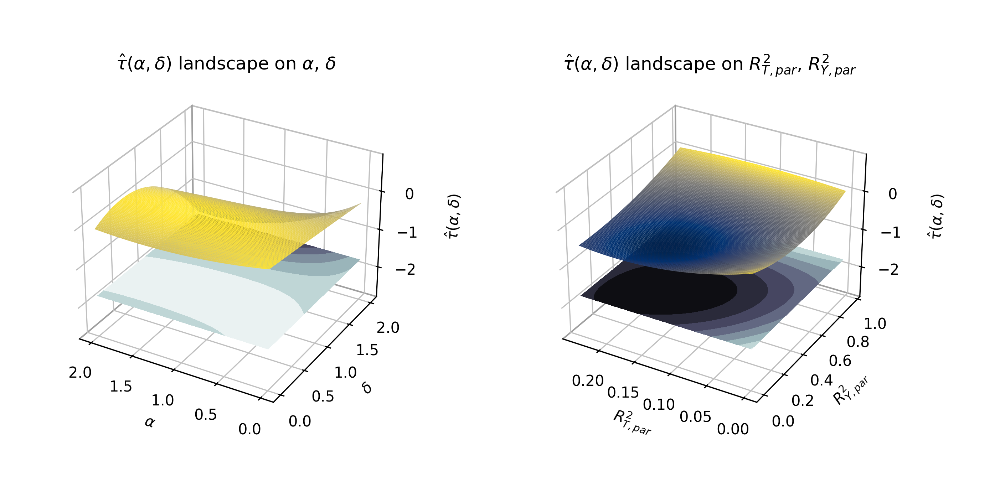

# [Imbens Sensitivity Analysis](https://pubs.aeaweb.org/doi/pdf/10.1257/000282803321946921)

A python implementation of Imbens Sensitivity Analysis

### import related packages
```import numpy as np
import pandas as pd

#optimization
from tqdm import tqdm
from scipy.optimize import minimize
from scipy import interpolate

#visualization
import matplotlib.pyplot as plt
from mpl_toolkits import mplot3d

#core function
from imbens import *
from utils  import *
```
### Data Preparation

Generate data based on what Imbens proposed
```
np.random.seed(256)
n = 10000

#X should always include a constant 1 column
X_df = gen_Exogenous(name = "X",
                     n = n,
                     m_cont = 3, m_cata = 2,
                     cont_params = [[1,0],[1,1],[-1,2]], cata_params = [[0.4,0.6],[0.4, 0.3, 0.3]])

U_df = gen_Exogenous(name = "U",
                    n = n,
                    m_cont = 0, m_cata = 1,
                    cont_params = [], cata_params = [[0.5, 0.5]])

```
Specify the effect size. Here user and choose between two configurations to better visualize the difference
```
config == 1
if config == 1:
    gamma        = np.array([0.5, -1.25, -0.75, -0.6, 0.3])
    alpha        = np.array([.8])

    tau          = np.array([0])
    beta         = np.array([0.75,-0.5, 0.2, 0.8, 0.5])
    delta        = np.array([1.0])

    sigma_square = 0.01
    epsilon      = np.random.normal(0, np.sqrt(sigma_square), n)


elif config == 2:
    gamma        = np.array([0.05, -0.125, -0.075, -0.06, 0.03])
    alpha        = np.array([.8])

    tau          = np.array([0])
    beta         = np.array([0.075,-0.05, 0.02, 0.08, 0.05])
    delta        = np.array([1.0])

    sigma_square = 0.01
    epsilon      = np.random.normal(0, np.sqrt(sigma_square), n)
```
Fill in the generative function of propensity score for the treatment and conditional expected value for the outcome.

```def sigmoid(x):
    return (1/(1 + np.exp(-x)))

#only observed
def g(X_df, gamma):
    g = np.dot(X_df.values, gamma)
    return pd.DataFrame(sigmoid(g), index = X_df.index, columns=["g"])

#True model
def g_tilde(X_df, U_df, gamma, alpha):
    g_tilde = np.dot(X_df.values, gamma) + np.dot(U_df.values, alpha)
    return pd.DataFrame(sigmoid(g_tilde), index = X_df.index, columns=["g_tilde"])


def Q(X_df, T_df, beta, tau):
    q = np.dot(X_df.values, beta) + np.dot(T_df.values, tau)
    return pd.DataFrame(q, index = X_df.index, columns=["Q"])

def Q_tilde(X_df, T_df, U_df, beta, tau, delta):
    q_tilde =  np.dot(X_df.values, beta) + np.dot(T_df.values, tau) + np.dot(U_df.values, delta)
    return pd.DataFrame(q_tilde, index = X_df.index, columns=["Q_tilde"])
```
Finally generate the simulation dataset
```
g_df = g(X_df, gamma)
g_tilde_df = g_tilde(X_df, U_df, gamma, alpha)

T_df = pd.DataFrame([np.random.binomial(1, g_tilde_df.values[i][0]) for i in range(len(g_tilde_df.values))],
                   index = g_tilde_df.index,
                   columns = ["T"])


Q_df = Q(X_df, T_df, beta, tau)
Q_tilde_df = Q_tilde(X_df, T_df, U_df, beta, tau, delta)

Y_df = pd.DataFrame(Q_tilde_df["Q_tilde"].values + epsilon,
                    index = Q_tilde_df.index,
                    columns = ["Y"])
```
### Core MLE estimate
```
mdl_0 = run_imbens(X_df, T_df, Y_df, alpha = 0, delta = 0)
```
### 2D contour plot with a specific target effect size
```
target_tau = mdl_0["tau_hat"][0] - 0.05
result_2d_df = contour_2d_search(target_tau,
                                 X_df, T_df, Y_df,

                                 #plot interval
                                 min_alpha = 0, max_alpha = 2,   num_alpha = 20,
                                 min_delta = 0, max_delta = 0.5,   num_delta = 20,

                                 outer_verbose = True,

                                 # search interval
                                 smin_delta = 0, smax_delta = 5,  #(when fix alpha search delta)
                                 smin_alpha = 0, smax_alpha = 20, #(when fix delta search alpha)

                                 precision = 0.0001, epsilon = 10**(-8), max_iter = 20,
                                 inner_verbose = False)
```

Calculate the critical values for each observed covariate
```
omit_vars_df = contour_2d_omit_vars(X_df, T_df, Y_df)
```
Visualize the contour plot
```
%matplotlib notebook
contour_2d_plot(result_2d_df, figsize = (10,4),
                title = r"contour plot ($\hat{\tau}(\alpha,\delta) = $" + f"{np.round(target_tau,2)})",
                smooth = True, kx = 1,
                show_covars = True, omit_vars_df = omit_vars_df,
                fmts = ["r.", "r+", "r1",  "r2"],
                save_as = f"../fig/simulation_contour_2d_target_tau_config_{config}.png", dpi = 300)
```



### 3D landscape plot with a grid search
```
result_3d_df = contour_3d_search(X_df, T_df, Y_df,
                                 min_alpha = 0, max_alpha = 2, num_alpha = 20,
                                 min_delta = 0, max_delta = 2, num_delta = 20)
```

Visualize the entire 3D landscape
```
%matplotlib notebook
contour_3d_plot(result_3d_df, figsize = (10,5),
                title = "3D contour plot",
                true_tau_lim = True,
                alpha_kx = 2, delta_ky = 2, RT_kx = 2, RY_ky = 2,
                save_as = f"../fig/simulation_contour_3d_config_{config}.png", dpi = 300)
```



# Config 2
## Here we also attach the result figures when run under configuration 2. When majority of the treatment status assignments and outcomes are not caused by any observed covariates. Both method declares that if unobserved confounder is as strong as observed ones then it is unlikely to see a target bias of 0.15.



