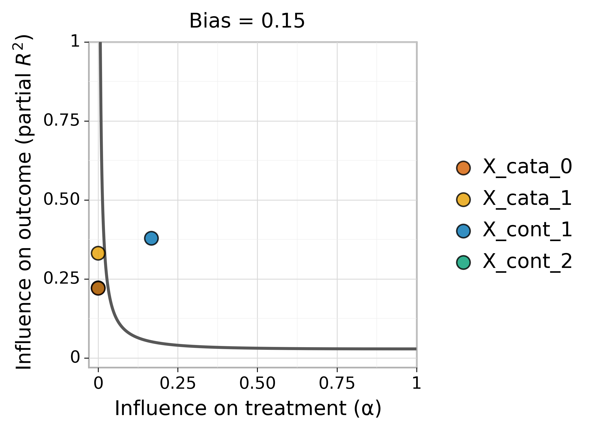
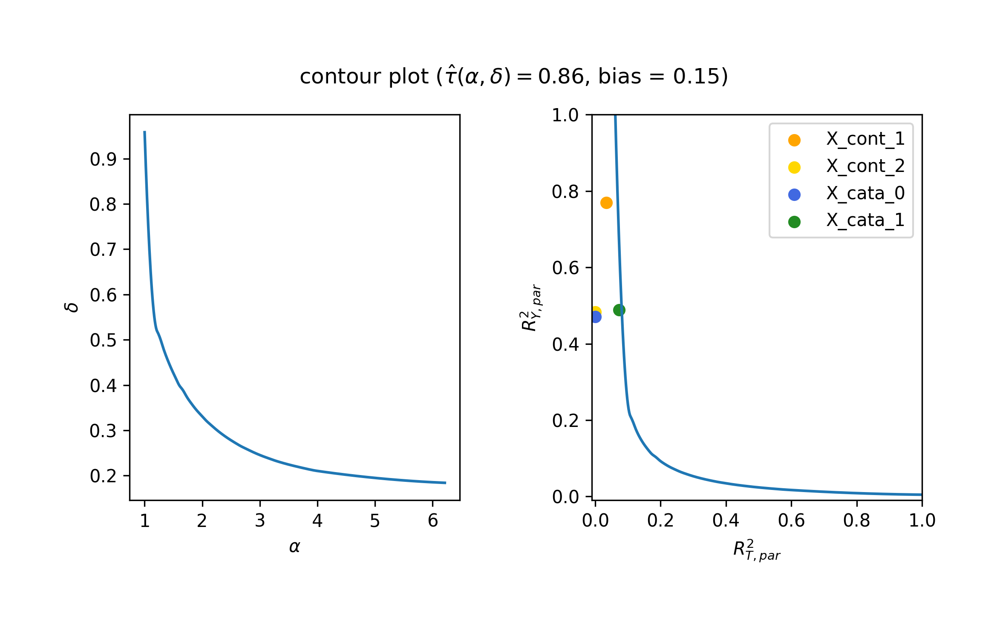
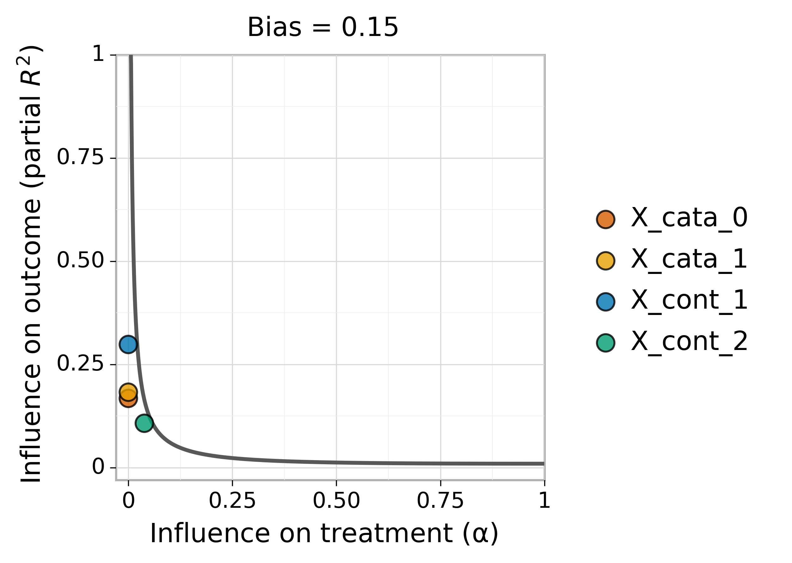
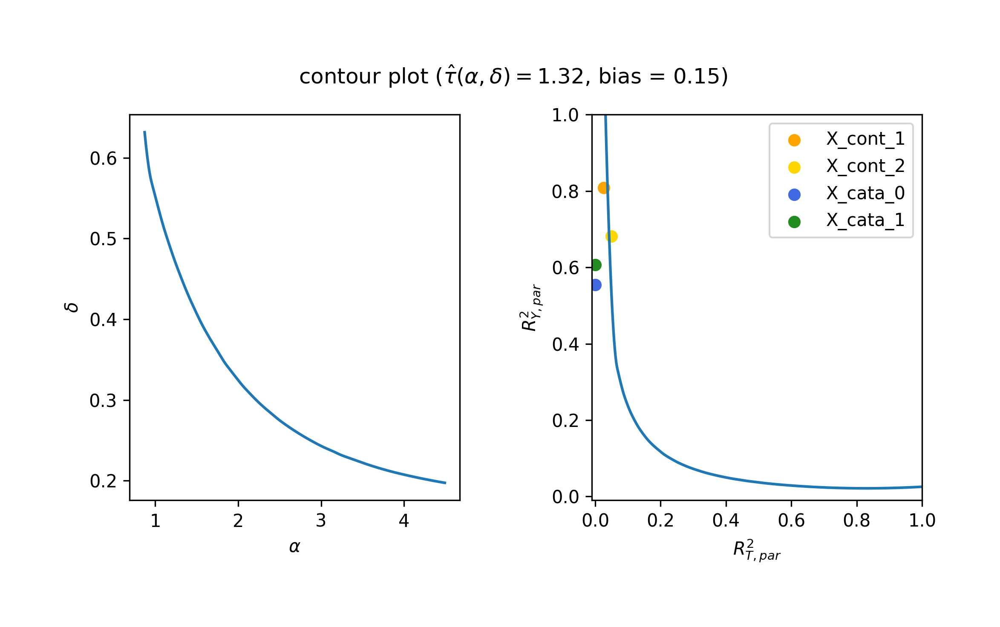

# Imbens Sensitivity Analysis vs Austen Plot

### import related packages
```
import numpy as np
import pandas as pd

#optimization
from tqdm import tqdm
from scipy.optimize import minimize
from scipy import interpolate

#visualization
import matplotlib.pyplot as pltÂ
from mpl_toolkits import mplot3d

#core function
from imbens import *
from utils  import *

from austen_plots.AustenPlot import AustenPlot
from sklearn.linear_model import LinearRegression
from sklearn.ensemble import RandomForestClassifier
```
# Data Preparation

## Exogenous part remains the same
## first 1000 samples will be only used to train the ML model used in austen plot
## bottom 1000 samples will be actually used to present the contour plots
```ÂÂ
np.random.seed(256)
n = 20000
n_train = 10000

#X should always include a constant 1 column
X_df = gen_Exogenous(name = "X",
                     n = n,
                     m_cont = 3, m_cata = 2,
                     cont_params = [[1,0],[0,1],[-1,2]], cata_params = [[0.4,0.6],[0.4, 0.3, 0.3]])

U_df = gen_Exogenous(name = "U",
                     n = n,
                     m_cont = 0, m_cata = 2,
                     cont_params = [], cata_params = [[0.4, 0.6], [0.6,0.4]])

full_df = pd.concat([X_df, U_df], axis = 1)

```
## Now we simulate treatment status base on a tree structure which is designed so that linear model won't be able to well capture the signal in the data.
### config 1: X determines most of the non-linear structure between X,U and T
### config 2: U determines most of the non-linear structure between X,U and T
```
config = 2

if config == 1:
    print("X determines most of the non-linear structure between X,U and T")
    def T_i(df_i):
        if df_i[1] > 0:
            if df_i[1] > 0.5:
                if df_i[1] > 1.5:
                    return 0
                else:
                    return 1
            else:
                if df_i[1] < 0.05:
                    return 1
                else:
                    return 0

        else:
            if df_i[2] > -1:
                if df_i[1] < -0.5:
                    return 1
                else:
                    return 0
            else:
                if df_i[4] > 0.5:
                    return 1
                else:
                    return 0
else:
    print("U determines most of the non-linear structure between X,U and T")
    def T_i(df_i):
        if df_i[-1] > 0.5:
            if df_i[-2] > 0.5:
                return 0
            else:
                if df_i[1] > 0:
                    return 0
                else:
                    return 1
        else:
            if df_i[-2] > 0.5:
                return 1
            else:
                if df_i[2] > -1:
                    return 0
                else:
                    return 1

def T(df):
    Ts = []
    for i in range(df.shape[0]):
        df_i = df.iloc[i,].values
        Ts = Ts + [T_i(df_i)]
    T_df = pd.DataFrame(Ts, index = df.index, columns = ["T"])
    return T_df
T_df = T(full_df)
```
## Conditional expected outcome remains a linear combination of X,U,T
$Y = \tau T + \beta X + \delta  U + \epsilon$ where $\epsilon \sim \mathcal N(0, \sigma^2)$

```
tau          = np.array([1])
beta         = np.array([0.75,-0.5, 0.2, 0.8, 0.5])
delta        = np.array([1.0, -0.6])

sigma_square = 0.01
epsilon      = np.random.normal(0, np.sqrt(sigma_square), n)

def Q(X_df, T_df, beta, tau):
    q = np.dot(X_df.values, beta) + np.dot(T_df.values, tau)
    return pd.DataFrame(q, index = X_df.index, columns=["Q"])

def Q_tilde(X_df, T_df, U_df, beta, tau, delta):
    q_tilde =  np.dot(X_df.values, beta) + np.dot(T_df.values, tau) + np.dot(U_df.values, delta)
    return pd.DataFrame(q_tilde, index = X_df.index, columns=["Q_tilde"])

Q_tilde_df = Q_tilde(X_df, T_df, U_df, beta, tau, delta)

Y_df = pd.DataFrame(Q_tilde_df["Q_tilde"].values + epsilon,
                    index = Q_tilde_df.index,
                    columns = ["Y"])
```
# Austen plot
```
austen_file       = "Austen/austen_df.txt"
austen_covar_path = "Austen/Austen_covars/"
```
## Learn propensity score via random forest
```
RF = RandomForestClassifier(max_depth=4, random_state=0)

# full X,U model
RF.fit(full_df.values[0:n_train,:],
       T_df.values.T[0][0:n_train])

g_tilde_df = pd.DataFrame(RF.predict_proba(full_df.values[n_train:n,:])[:,1],
                          index = full_df.index[n_train:n],
                          columns = ["g_tilde"])

# observed X model
RF.fit(X_df.values[0:n_train,:],
       T_df.values.T[0][0:n_train])

g_df = pd.DataFrame(RF.predict_proba(X_df.values[n_train:n,:])[:,1],
                    index = full_df.index[n_train:n],
                    columns = ["g"])
```

## Learning conditional expectation with linear regression
```
LR = LinearRegression()

LR.fit(X_df.values[0:n_train,:],
       Y_df.values.T[0][0:n_train])
Q_df = pd.DataFrame(LR.predict(X_df.values[n_train:n,:]),
                    index = full_df.index[n_train:n], columns = ["Q"])

austen_df = pd.concat([g_df,Q_df,T_df.iloc[n_train:n,:],Y_df.iloc[n_train:n,:]], axis = 1)
austen_df.columns = ["g","Q", "t", "y"]
austen_df.to_csv(austen_file, index=False)

```

# Austen 2D-Contour
### Clearly X_count_1 is marked as a covariate that if unobserved could lead to a target bias of 0.15. Indeed, majority of the treatment assignment is based on a non-linear tree structure stratification of the values that feature takes.
```
target_bias = 0.15
ap = AustenPlot(austen_file, austen_covar_path)
p, plot_coords, variable_coords = ap.fit(bias=target_bias) # recall we set target_bias=2.0
p
```


# Imbens
```
mdl_0 = run_imbens(X_df.iloc[n_train:n,:],
                   T_df.iloc[n_train:n,:],
                   Y_df.iloc[n_train:n,:],
                   alpha = 0, delta = 0)
```
## 2D contour plot with a specific target effect size
```
target_tau = mdl_0["tau_hat"][0] - target_bias
omit_vars_df = contour_2d_omit_vars(X_df.iloc[n_train:n,:], T_df.iloc[n_train:n,:], Y_df.iloc[n_train:n,:])

result_2d_df = contour_2d_search(target_tau,
                                 X_df.iloc[n_train:n,:], T_df.iloc[n_train:n,:], Y_df.iloc[n_train:n,:],

                                 #plot interval
                                 min_alpha = 1, max_alpha = 4,   num_alpha = 20,
                                 min_delta = 0.25, max_delta = 1,   num_delta = 20,

                                 outer_verbose = True,

                                 # search interval
                                 smin_delta = 0, smax_delta = 5,  #(when fix alpha search delta)
                                 smin_alpha = 0, smax_alpha = 20, #(when fix delta search alpha)

                                 precision = 0.0001, epsilon = 10**(-8), max_iter = 20,
                                 inner_verbose = False)
```

## Visualize the contour plot
### Imbens model which attempts to use linear model to capture treatment assignment effect fails in this case and claim that ignoring X_cont_1 wont change the estimated effect size by the target bias amount.
```
%matplotlib notebook
%matplotlib notebook
contour_2d_plot(result_2d_df, figsize = (8,4),
                title = r"contour plot ($\hat{\tau}(\alpha,\delta) = $" + f"{np.round(target_tau,2)}, bias = {target_bias})",
                smooth = True, kx = 1,
                show_covars = True, omit_vars_df = omit_vars_df,
                colors = ["orange","gold","royalblue", "forestgreen"],
                save_as = f"../fig/tree_simulation_contour_2d_config_{config}.png", dpi = 300)
```



# Config 2
## Here we also attach the result figures when run under configuration 2. When majority of the treatment status assignments is not caused by any observed covariates. Both method declares that if unobserved confounder is as strong as observed ones then it is unlikely to see a target bias of 0.15.



